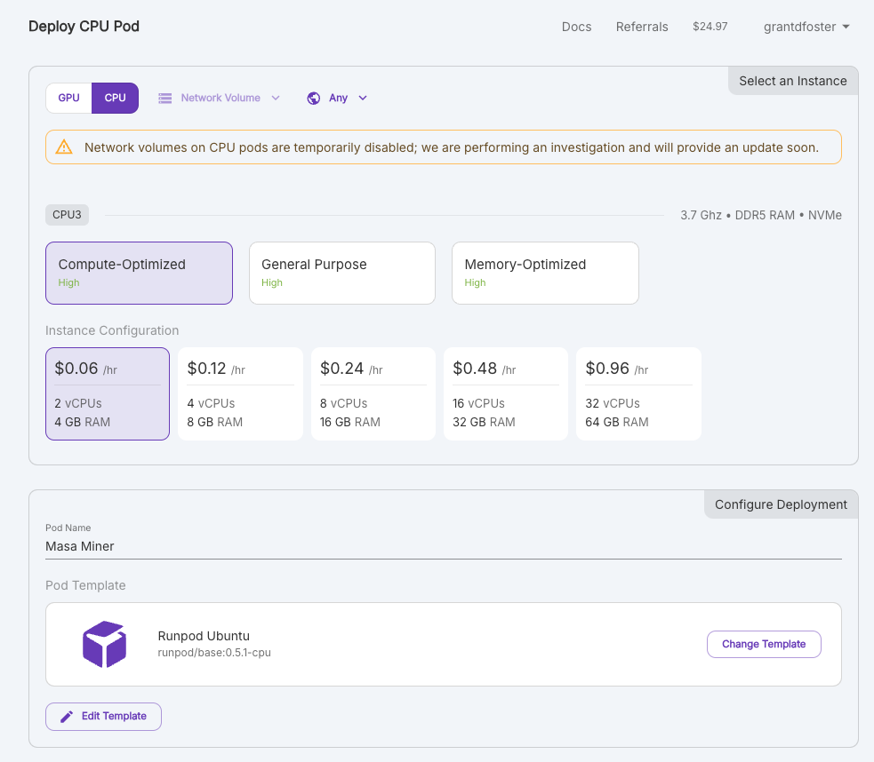
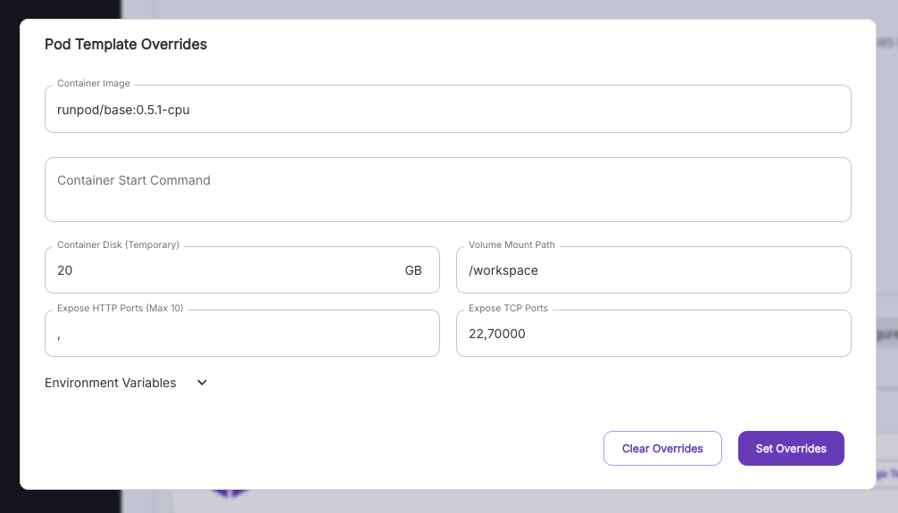

## Get a runpod account

Sign up for a [Runpod](https://runpod.io) account and head to [pods](https://www.runpod.io/console/pods)

## Deploy a pod

Click "deploy a pod" and edit the default configuration via "edit template".

## Add exposed port

You'll need a symmetric port to run the miner on - in runpod, symmetric ports can be defined by using port 70000 and above. Upon deployment, you will be assigned a symmetrical port number to run a validator from. Also be sure to set container disk to 20GB.

