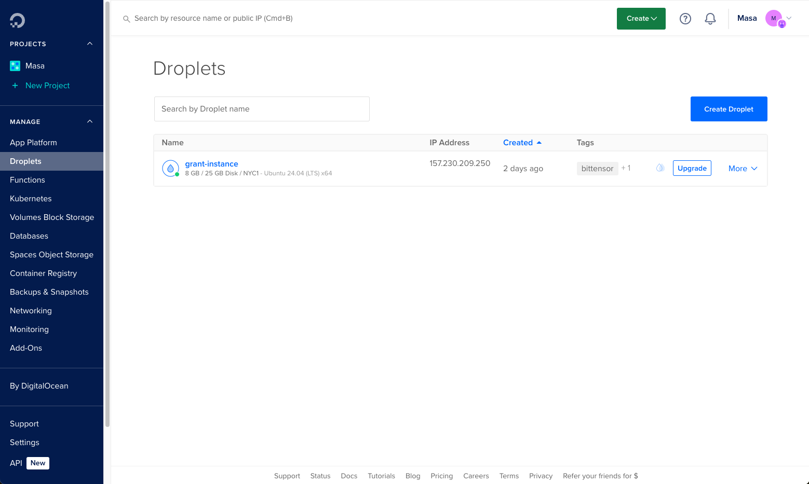
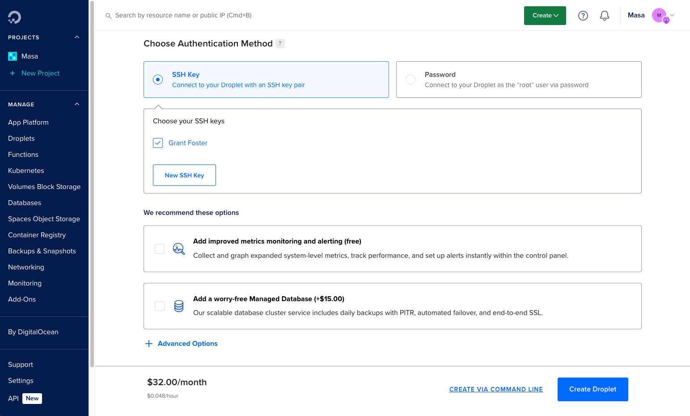

## Setup a Digital Ocean account

Sign up for a **[Digital Ocean](https://cloud.digitalocean.com/)** account and head to **[droplets](https://cloud.digitalocean.com/droplets)**.



## Configure a Droplet

Click "Create Droplet". The default configuration is fine, but you can change the size of the droplet to your liking.


## Configure Authentication

Select "SSH Key" and create a new SSH key by following the instructions.



## Create Droplet

Click "Create Droplet" and wait for the droplet to be created!

## Connect to your Droplet via SSH

Open up a new terminal and connect to your droplet via SSH. Use the IP address of the droplet, found in the **[Droplets](https://cloud.digitalocean.com/droplets)** dashboard.

```bash
ssh -i ~/.ssh/id_rsa root@<droplet-ip-address>
```

Type `yes` when prompted, and you're in!
