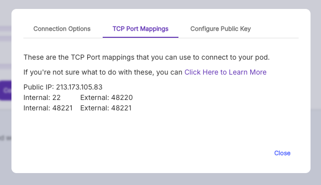

In the masa-bittensor directory, create an .env file

```bash
vim .env
```

Add the following variable to your .env file, replacing the URL with your oracle node's URL

```bash
ORACLE_BASE_URL="http://localhost:8080/api/v1"
```

### Edit Makefile

```bash
vim Makefile
```

We need to set our ports correctly! Grab the symmetrical port from the TCP Port Mappings in runpod and replace `--axon.port 8092` in run-validator with said port (e.g. `--axon.port 48221`)



Save and continue

```bash
:wq
```
