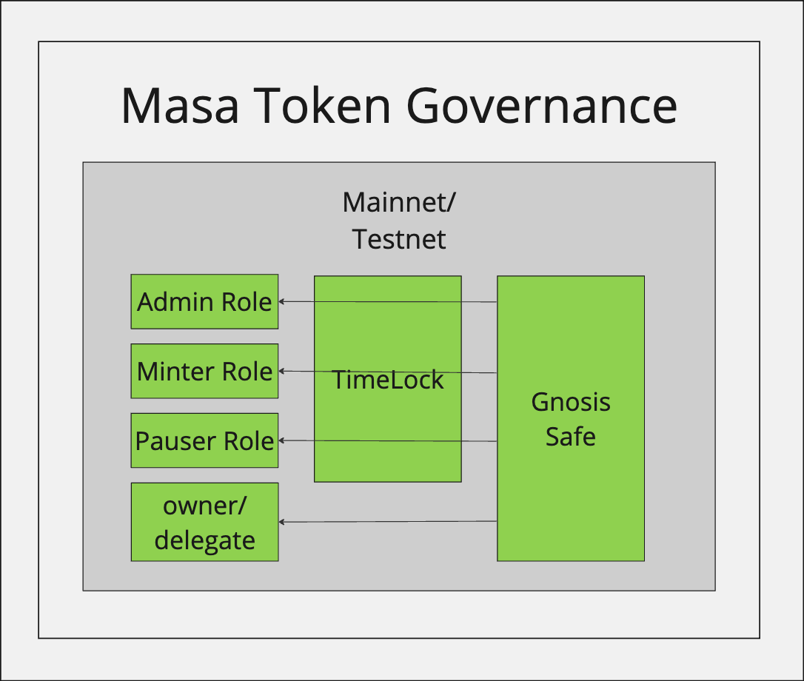
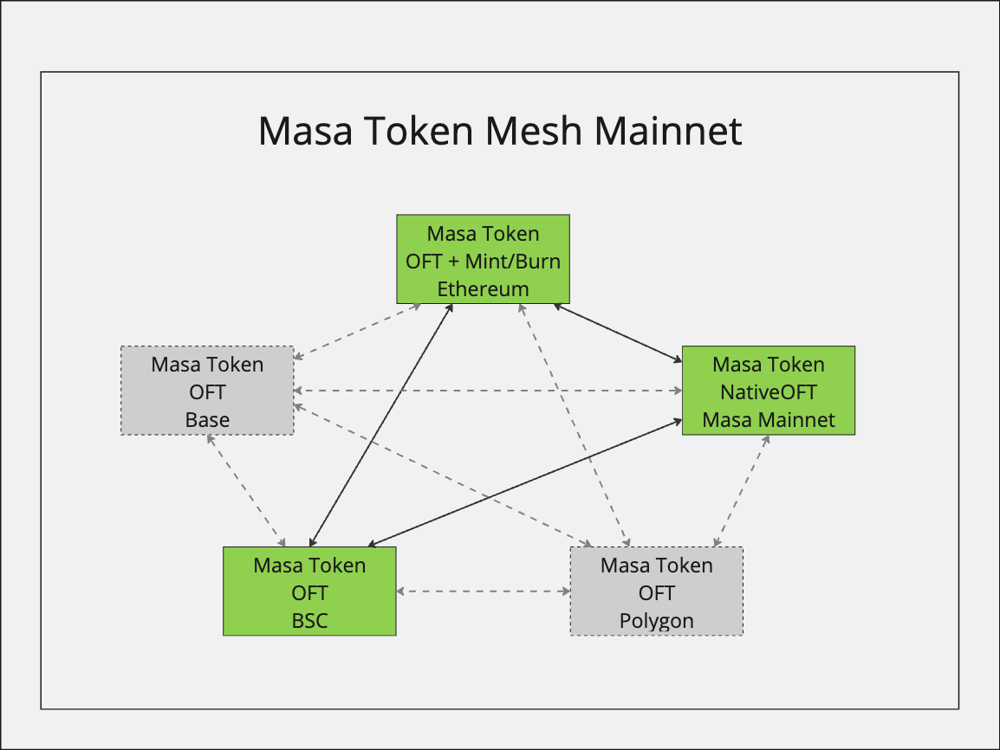
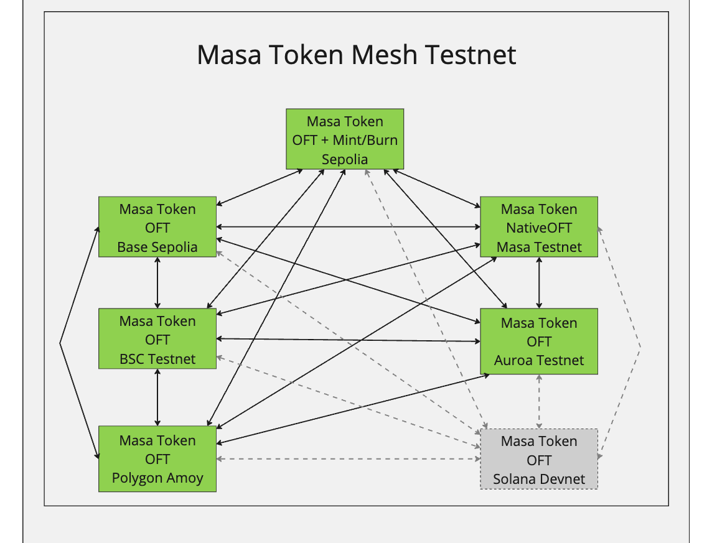

# Masa Token Governance

<!-- TOC -->

- [Masa Token Governance](#masa-token-governance)
  - [Masa Token Governance](#masa-token-governance-1)
  - [Masa Token Mesh](#masa-token-mesh)
    - [Mainnets](#mainnets)
    - [Testnets](#testnets)
- [Networks](#networks)
  - [Masa](#masa)
    - [Masa Testnet](#masa-testnet)
  - [Ethereum](#ethereum)
    - [Sepolia](#sepolia)
  - [Binance Smart Chain](#binance-smart-chain)
    - [Binance Smart Chain Testnet](#binance-smart-chain-testnet)
  - [Base](#base)
    - [Base Sepolia](#base-sepolia)
  - [Polygon](#polygon)
    - [Polygon Amoy](#polygon-amoy)
  - [Aurora](#aurora)
    - [Aurora Testnet](#aurora-testnet)
  - [Solana](#solana)
    - [Solana Devnet](#solana-devnet)

<!-- TOC -->

### Masa Token Governance

### Masa Token Mesh

#### Mainnets

#### Testnets

# Networks

## Masa

- Token Address: [0x944824290CC12F31ae18Ef51216A223Ba4063092](https://subnets.avax.network/masa/address/0x944824290CC12F31ae18Ef51216A223Ba4063092)
- TimeLock Address: [0x320F5AE538A9A4Ba8D01DB660304f0fC49100DBF](https://subnets.avax.network/masa/address/0x320F5AE538A9A4Ba8D01DB660304f0fC49100DBF)
- Admin Address: [0x06168A0f16DFbe0cea6fa3E2807026617C96a2b8](https://subnets.avax.network/masa/address/0x06168A0f16DFbe0cea6fa3E2807026617C96a2b8)

### Masa Testnet

- Token Address: [0xBBa19ecaE1202e94ebEB78821A5738d6A7434Dc7](https://subnets-test.avax.network/masatestnet/address/0xBBa19ecaE1202e94ebEB78821A5738d6A7434Dc7)
- TimeLock Address: none
- Admin Address: [0x19B35C375BE865A902423590f68B8B5f0ec02574](https://subnets-test.avax.network/masatestnet/address/0x19B35C375BE865A902423590f68B8B5f0ec02574)

## Ethereum

- Token Address: [0x944824290CC12F31ae18Ef51216A223Ba4063092](https://etherscan.io/token/0x944824290CC12F31ae18Ef51216A223Ba4063092)
- TimeLock Address: [0xd22E422851E4814d72144248cA44d22b8168B823](https://etherscan.io/address/0xd22E422851E4814d72144248cA44d22b8168B823)
- Admin Address: [0x0f97D276203408a410d430b5dada7870AE1E45C9](https://etherscan.io/address/0x0f97D276203408a410d430b5dada7870AE1E45C9)

### Sepolia

- Token Address: [0xFd36990172dFB44ef0cEa51a9B1159687CfBb4E2](https://sepolia.etherscan.io/token/0xFd36990172dFB44ef0cEa51a9B1159687CfBb4E2)
- TimeLock Address: [0x471e69B65c5b00FdBeB0f343CD46F98E4ea6F5ae](https://sepolia.etherscan.io/address/0x471e69B65c5b00FdBeB0f343CD46F98E4ea6F5ae)
- Admin Address: [0x574f1dC03c4ACBa6b401fDC607610BF10A1659fF](https://sepolia.etherscan.io/address/0x574f1dC03c4ACBa6b401fDC607610BF10A1659fF)

## Binance Smart Chain

- Token Address: [0x944824290CC12F31ae18Ef51216A223Ba4063092](https://bscscan.com/address/0x944824290CC12F31ae18Ef51216A223Ba4063092)
- TimeLock Address: [0x320F5AE538A9A4Ba8D01DB660304f0fC49100DBF](https://bscscan.com/address/0x320F5AE538A9A4Ba8D01DB660304f0fC49100DBF)
- Admin Address: [0xD9f8D4359C034E1290d83b70e73e32fdd31a663B](https://bscscan.com/address/0xD9f8D4359C034E1290d83b70e73e32fdd31a663B)

### Binance Smart Chain Testnet

- Token Address: [0xB99CA5896D3cb306B6066e22B3CB82eA10361279](https://testnet.bscscan.com/address/0xB99CA5896D3cb306B6066e22B3CB82eA10361279)
- TimeLock Address: none
- Admin Address: [0xd207773F00222aA85A44770ed18F9D09861F6f0b](https://testnet.bscscan.com/address/0xd207773F00222aA85A44770ed18F9D09861F6f0b)

## Base

- Token Address: [0x944824290CC12F31ae18Ef51216A223Ba4063092](https://basescan.org/address/0x944824290CC12F31ae18Ef51216A223Ba4063092)
- TimeLock Address: [0x320F5AE538A9A4Ba8D01DB660304f0fC49100DBF](https://basescan.org/address/0x320F5AE538A9A4Ba8D01DB660304f0fC49100DBF)
- Admin Address: [0x503aac45399e32B99BD6Ffa83F723D367f15e222](https://basescan.org/address/0x503aac45399e32B99BD6Ffa83F723D367f15e222)

### Base Sepolia

- Token Address: [0x6fECCe51a6C4881e68F6460e0d73686e736c44D7](https://sepolia.basescan.org/address/0x6fECCe51a6C4881e68F6460e0d73686e736c44D7)
- TimeLock Address: [0xd87Dd24903f06b9A32eE0f996dD39039FaA94fD8](https://sepolia.basescan.org/address/0xd87Dd24903f06b9A32eE0f996dD39039FaA94fD8)
- Admin Address: [0x503aac45399e32B99BD6Ffa83F723D367f15e222](https://sepolia.basescan.org/address/0x503aac45399e32B99BD6Ffa83F723D367f15e222)

## Polygon

- Token Address: []
- TimeLock Address: []
- Admin Address: []

### Polygon Amoy

- Token Address: [0x784F4d8fB4bf51431e47b014DdA159e31ACC714e](https://amoy.polygonscan.com/address/0x784F4d8fB4bf51431e47b014DdA159e31ACC714e)
- TimeLock Address: [0x78A660183257C4699a57a2D85a7Cf49b4DA75A6E](https://amoy.polygonscan.com/address/0x78A660183257C4699a57a2D85a7Cf49b4DA75A6E)
- Admin Address: [0x46c9cdA3F83C5c13C767A07b6E80aEd302E40B28](https://amoy.polygonscan.com/address/0x46c9cdA3F83C5c13C767A07b6E80aEd302E40B28)

## Aurora

- Token Address: []
- TimeLock Address: []
- Admin Address: []

### Aurora Testnet

- Token Address: [0x784F4d8fB4bf51431e47b014DdA159e31ACC714e](https://explorer.testnet.aurora.dev/address/0x784F4d8fB4bf51431e47b014DdA159e31ACC714e)
- TimeLock Address: [0x78A660183257C4699a57a2D85a7Cf49b4DA75A6E](https://explorer.testnet.aurora.dev/address/0x78A660183257C4699a57a2D85a7Cf49b4DA75A6E)
- Admin Address: [0x46c9cdA3F83C5c13C767A07b6E80aEd302E40B28](https://explorer.testnet.aurora.dev/address/0x46c9cdA3F83C5c13C767A07b6E80aEd302E40B28)

## Solana

- Token Address: []
- TimeLock Address: []
- Admin Address: []

### Solana Devnet

- Token Address: []
- TimeLock Address: []
- Admin Address: []
