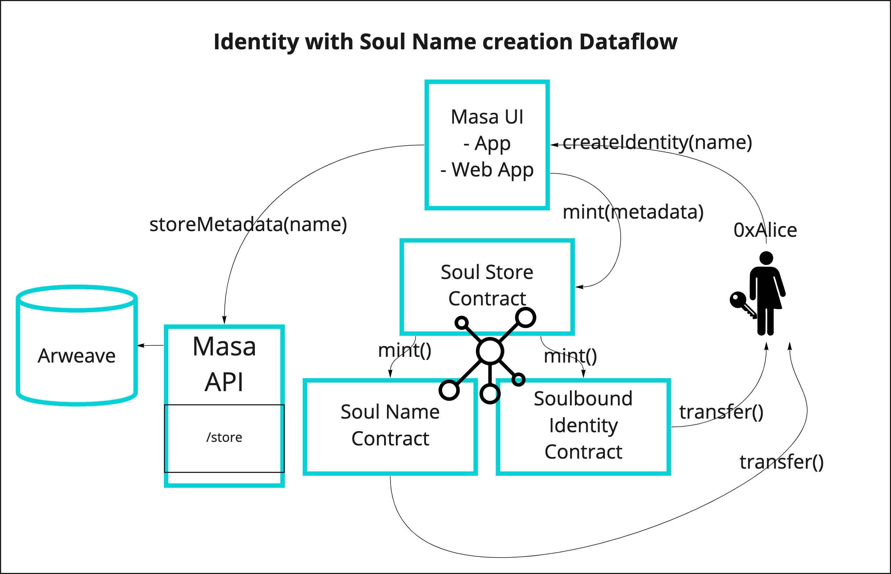
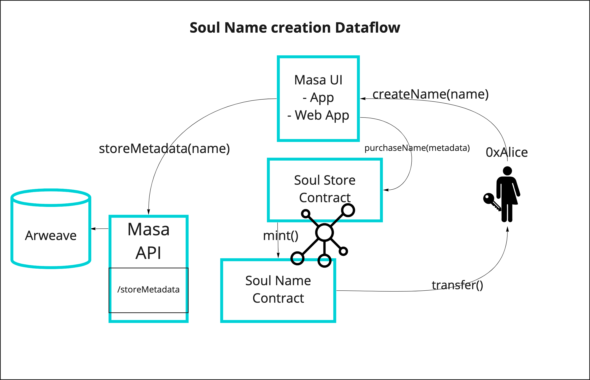

# Metadata Schema

<!-- TOC -->

* [Metadata Schema](#metadata-schema)
    * [Soulbound Identity](#soulbound-identity)
        * [Creation Process](#creation-process)
    * [Soulbound Credit Report](#soulbound-credit-report)
        * [Creation Process](#creation-process)
    * [Soulbound 2FA](#soulbound-2fa)
        * [Creation Process](#creation-process)
    * [Soul Names](#soul-names)
        * [Creation Process](#creation-process)

<!-- TOC -->

## Soulbound Identity

Endpoint: `https://metadata.masa.finance/v1.0/identity/<TokenId>.json`

See [here](./identity/metadata.json) for a sample and [here](./identity/metadata_authenticated.json) for an
authenticated example

```typescript
interface IIdentity {
  name: "Masa Soulbound Identity v1.0.0";
  description: "A self-sovereign identity for accessing DeFi";
  image: "https://metadata.masa.finance/v1.0/identity/masa-identity.png";
  properties: {
    tokenId: string;
    account?: string;
    soulName?: string;
  };
}
```

### Creation Process



## Soulbound Credit Report

Endpoint: `https://metadata.masa.finance/v1.0/credit-report/<TokenId>.json`

See [here](./credit-report/metadata.json) for a sample and [here](./credit-report/metadata_authenticated.json) for an
authenticated example

```typescript
interface ICreditReport {
  name: "Masa Soulbound Credit Report v1.0.0";
  description: "A decentralized credit report";
  image: "https://metadata.masa.finance/v1.0/identity/credit-report.png";
  properties: {
    tokenId: string;
    account?: string;
    lastUpdated?: string;
    model_version?: string;
    value?: number;
    decile?: string;
    value_rating?: string;
  };
}
```

### Creation Process


## Soulbound 2FA

Endpoint: `https://metadata.masa.finance/v1.0/2fa/<TokenId>.json`

See [here] for a sample and [here] for an
authenticated example

```typescript
interface I2fa {
  name: "Masa Soulbound 2FA v1.0.0";
  description: "A decentralized 2fa";
  image: "https://metadata.masa.finance/v1.0/2fa/2fa.png";
  properties: {
    tokenId: string;
    account?: string;
  };
}

```

### Creation Process


## Soul Names

The metadata for the Soul Name contract can be
found [here](https://github.com/masa-finance/masa-contracts-identity/blob/main/metadata/SoulName.json)

Endpoint: `ar://<arweave id>`

See [here](./soul-name/metadata.json) for a sample

```typescript
interface Attribute {
  display_type?: string;
  trait_type: string;
  value: number | string;
}

interface ISoulName {
  description: "This is a soul name!";
  external_url: "https://app.masa.finance";
  image: string;
  name: string;
  attributes: Attribute[];
}

```

### Creation Process

