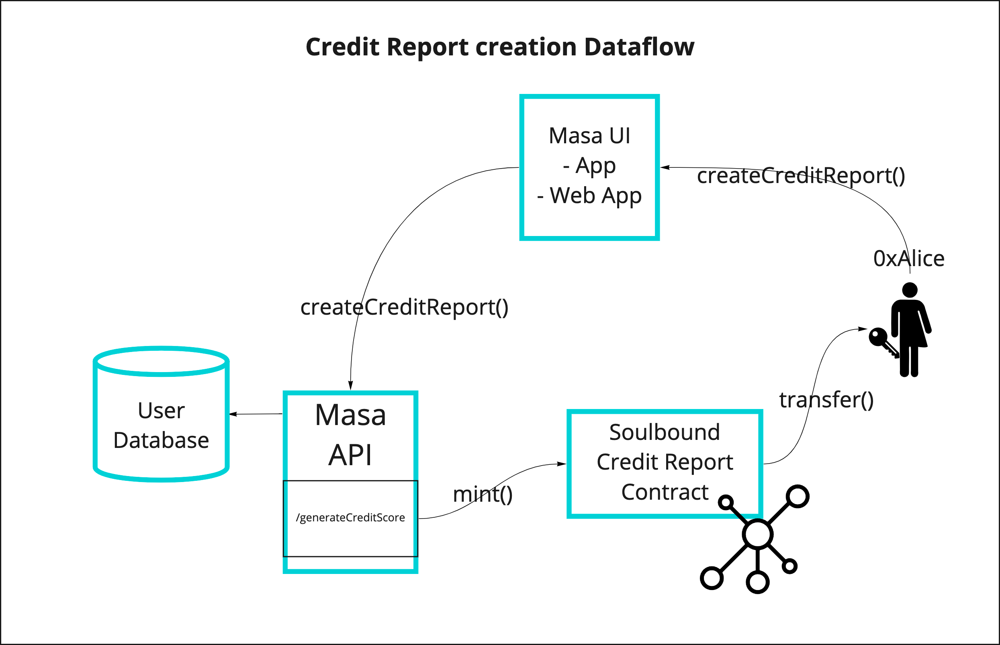
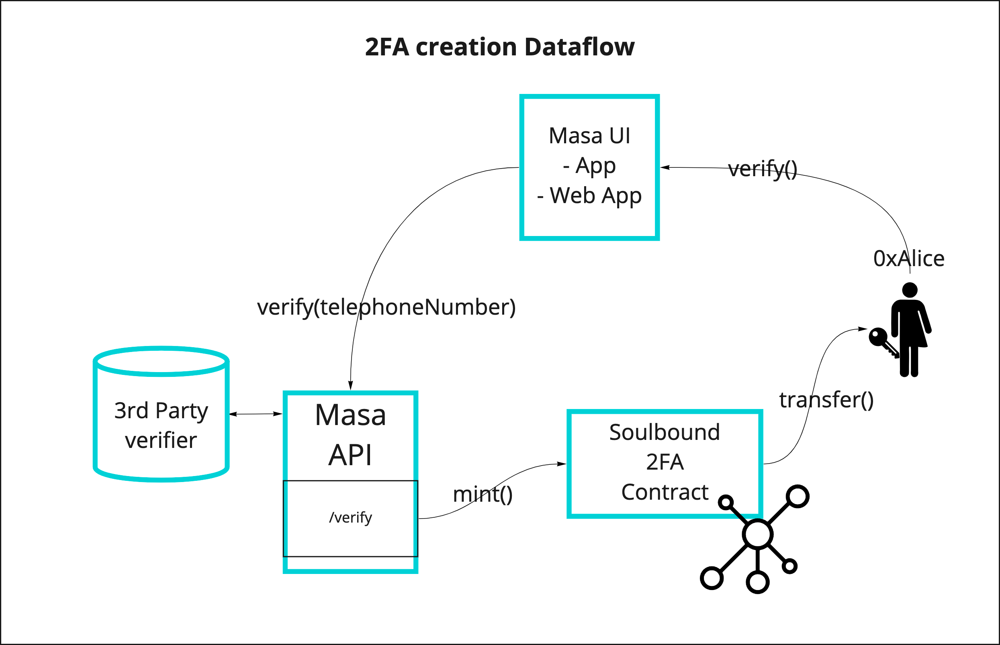

# Metadata Schema

<!-- TOC -->
* [Metadata Schema](#metadata-schema)
  * [Soulbound Identity](#soulbound-identity)
    * [Creation Process](#creation-process)
  * [Soulbound Credit Score](#soulbound-credit-score)
    * [Creation Process](#creation-process-1)
  * [Soulbound Green](#soulbound-green)
    * [Creation Process](#creation-process-2)
  * [Soul Names](#soul-names)
    * [Creation Process](#creation-process-3)
<!-- TOC -->

## Soulbound Identity

Endpoint: `https://metadata.masa.finance/v1.0/identity/<TokenId>.json`

See [here](./identity/metadata.json) for a sample and [here](./identity/metadata_authenticated.json) for an
authenticated example

```typescript
interface IIdentity {
  name: "Masa Soulbound Identity v1.0.0";
  description: "A self-sovereign identity for accessing DeFi";
  image: "https://metadata.masa.finance/v1.0/identity/masa-identity.png";
  properties: {
    tokenId: string;
    account?: string;
    soulName?: string;
  };
}
```

### Creation Process


## Soulbound Credit Score

Endpoint: `https://metadata.masa.finance/v1.0/credit-score/<TokenId>.json`

See [here](./credit-score/metadata.json) for a sample and [here](./credit-score/metadata_authenticated.json) for an
authenticated example

```typescript
interface ICreditScore {
  name: "Masa Soulbound Credit Score v1.0.0";
  description: "A decentralized credit score";
  image: "https://metadata.masa.finance/v1.0/credit-score/credit-score.png";
  properties: {
    tokenId: string;
    identityId?: string;
    account?: string;
    lastUpdated?: string;
    model_version?: string;
    value?: number;
    decile?: string;
    value_rating?: string;
  };
}
```

### Creation Process



## Soulbound Green

Endpoint: `https://metadata.masa.finance/v1.0/green/<TokenId>.json`

See [here] for a sample and [here] for an
authenticated example

```typescript
interface IGreen {
  name: "Masa Soulbound Green v1.0.0";
  description: "Masa Green is a decentralized authentication solution";
  image: "https://metadata.masa.finance/v1.0/green/green.png";
  properties: {
    tokenId: string;
    identityId?: string;
    account?: string;
  };
}
```

### Creation Process



## Soul Names

The metadata for the Soul Name contract can be
found [here](https://github.com/masa-finance/masa-contracts-identity/blob/main/metadata/SoulName.json)

Endpoint: `ar://<arweave id>`

See [here](./soul-name/metadata.json) for a sample

```typescript
interface Attribute {
  display_type?: string;
  trait_type: string;
  value: number | string;
}

interface ISoulName {
  description: "This is a soul name!";
  external_url: string
  name: string;
  image: string;
  imageHash: string;
  imageHashSignature: string;
  network: string;
  chainId: string;
  signature: string;
  attributes: Attribute[];
}
```

### Creation Process

